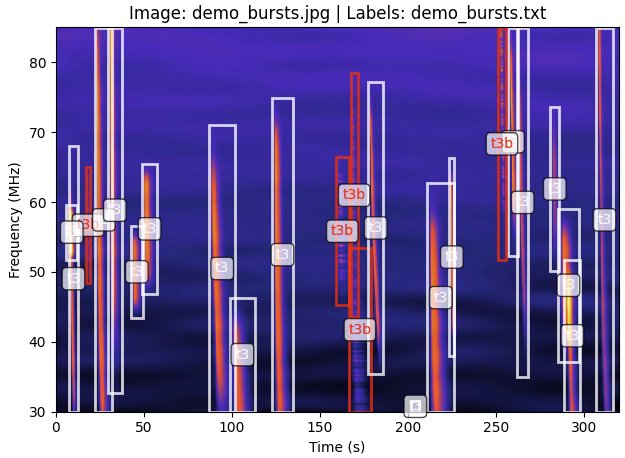
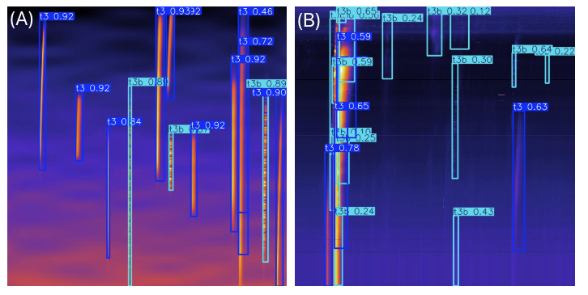

# Summary

**PhySynthTrainer** is a Python package for generating physics-based synthetic solar radio bursts, specifically type III, type IIIb, and type II events.  It is designed as a research tool to produce labeled training datasets for machine learning models in solar radio burst detection. By embedding physically realistic emission patterns derived from theoretical and statistical models, **PhySynthTrainer** enables the creation of ground-truth datasets without the biases, delays, and inconsistencies associated with manual human labeling.


# Statement of need

Solar radio burst is a good indicators of solar activity and particle acceleration. In particular, type III bursts are generated by energetic electrons escaping along open magnetic field lines, and type II bursts are associated with plasma shock waves propagating through the corona. Real-time detection and interpretation of these radio emissions can provide diagnostics of coronal plasma conditions and energetic particles, directly supporting space-weather monitoring and operations that protect satellite systems, radio communications, navigation, aviation, and the electrical grid.


While automated, real-time detection from dynamic spectra remains challenging: burst morphologies span multiple timescales and frequencies, can overlap, and are embedded in nonstationary backgrounds and radio-frequency interference (RFI). Classical approaches (e.g., Hough-transform–based line/curve detection) have shown promise but are sensitive to parameter tuning and do not generalize robustly across instruments or events [@zhang2018type]. Recent machine-learning methods improve adaptability [@sun2025exploring], yet they face a fundamental bottleneck: obtaining high-quality labeled training data. Manual annotation is labor-intensive, slow, and susceptible to human bias and inconsistency, which limits dataset size and introduces label noise.

PhySynthTrainer addresses this data bottleneck by generating physics-based synthetic dynamic spectra of type III, type IIIb, and type II bursts, with controllable parameters according to prior observational and theoretical studies [@leblanc1998tracing], [@mann2018tracking], [@zhang2019source], [@reid2021fine]. The synthetic data are produced together with ground-truth labels (time–frequency extents and classes), enabling scalable training, benchmarking, and testing of detection models. The intended users are solar radio researchers, instrument and pipeline teams, and machine-learning practitioners who need abundant, labeled, and physically informed synthetic observational data to develop and evaluate real-time burst detection systems.


# Implementation

**PhySynthTrainer** is implemented in Python and uses standard scientific libraries (`numpy`, `scipy`, `matplotlib`) for numerical calculations and visualization. Burst morphology is determined by parametric equations describing frequency drift and intensity envelopes, with randomization parameters sampled from published statistical distributions. Fine structures such as the striae of type IIIb bursts are modeled as amplitude modulations along the burst trajectory.

Key features include:
- Generation of individual bursts or composite dynamic spectra with multiple events.
- Adjustable parameters for burst speed, bandwidth, drift rate, start/end frequency, and duration.
- Noise injection and background simulation to mimic real instrument conditions.
- Output as both numerical arrays and publication-ready plots.

# Example usage

```python
import numpy as np
from physynthtrainer.burstGen import generate_type_iii_burst
from physynthtrainer.utils import paint_arr_to_jpg, export_yolo_label, plot_jpg_labeling
# Generate a single type III burst
img_bursts, mask, bbox = generate_type_iii_burst(fine_structure=True)

# Save the burst image and export the label file
paint_arr_to_jpg(img_bursts, filename='type3b_burst.jpg')
label_file = export_yolo_label([bbox],  ['t3b'], output_dir='./',  base_filename='demo_bursts')
```

Example of radio burst generated
{#sylt width="60%"}


# Applications

The primary application of PhySynthTrainer is in creating large labeled datasets for machine learning training.
In tests, a YOLOv8 object detection model trained on synthetic data demonstrated strong performance in detecting type III, type IIIb, and type II bursts in real radio dynamic spectra, indicating the utility of physics-based synthetic training data.




# Acknowledgements

The development of PhySynthTrainer was supported by the NASA Jack Eddy Fellowship.


# References

